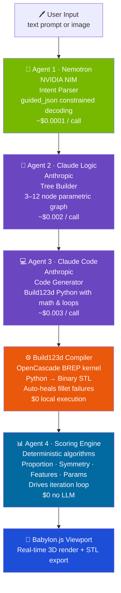
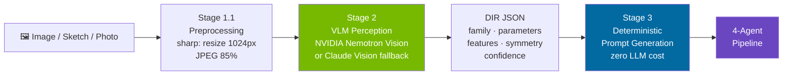

<div align="center">

# ParaGraph

[](LICENSE)
[](https://nextjs.org)
[](https://typescriptlang.org)
[](https://github.com/gumyr/build123d)
[](https://build.nvidia.com)
[](https://anthropic.com)
[](https://babylonjs.com)

[Quick Start](#getting-started) · [Architecture](#architecture) · [API Reference](docs/api-reference.md) · [Challenges](CHALLENGES.md) · [Contributing](CONTRIBUTING.md)

</div>

---

## What Is ParaGraph?

**AI parametric design studio** — describe a real-world 3D object in words or images, and get an editable parametric model that improves itself.

---

## What Makes It Different

| Traditional AI 3D Tools | ParaGraph |
|:---|:---|
| Generate static, uneditable meshes | Generate **editable parametric systems** |
| Black-box generation — no explanation | Every step **logged, explained, reversible** |
| One-shot, hope for the best | **Autonomous iteration** with objective scoring |
| Manual editing in another tool | **Natural language editing** of any parameter |
| No quality measurement | **Objective scoring** — proportion, symmetry, features, params |
| Fail silently on bad geometry | **Auto-healing** — fillet errors retry without fillets |

---

## Architecture

### Multi-Agent Pipeline



### Image-to-Design Pipeline



> **Key insight:** The VLM only handles *perception* (Stage 2). The prompt is assembled deterministically (Stage 3) — no LLM hallucinating geometry specs.

```
Image (photo/sketch/render)
    │
    ▼
┌──────────────────────────────────────┐
│  Stage 1.1: Preprocessing (sharp)    │
│  • Resize to max 1024px              │
│  • Convert to JPEG 85%              │
│  • Normalize for VLM consumption     │
└──────────────────┬───────────────────┘
                   │
                   ▼
┌──────────────────────────────────────┐
│  Stage 2: VLM → DIR Extraction       │
│  • NVIDIA Nemotron Vision (primary)  │
│  • Claude Vision (fallback)          │
│  • Outputs Design Intent JSON:       │
│    - family classification           │
│    - shape parameters                │
│    - feature detection               │
│    - symmetry analysis               │
└──────────────────┬───────────────────┘
                   │ DIR JSON
                   ▼
┌──────────────────────────────────────┐
│  Stage 3: DIR → Deterministic Prompt │
│  • No LLM needed — pure templates   │
│  • Family → natural language         │
│  • Features → parameter specs       │
└──────────────────┬───────────────────┘
                   │ Text prompt
                   ▼
           Existing 4-agent pipeline
```

### Tech Stack

| Layer | Technology | Purpose |
|:---|:---|:---|
| Framework | Next.js 16, TypeScript, Tailwind CSS | Full-stack app with SSE streaming |
| 3D Viewport | Babylon.js | Real-time STL rendering + camera controls |
| Node Graph | React Flow | Parametric dependency visualization |
| State | Zustand | Single global store |
| Layout | react-resizable-panels | Resizable 4-panel split layout |
| CAD Engine | Build123d + OpenCascade (Python) | BREP geometry → binary STL |
| Intent Parser | NVIDIA Nemotron NIM + `guided_json` | NL → guaranteed-valid structured JSON |
| Tree Builder | Claude Sonnet via resilientChat() | JSON → typed dependency graph |
| Code Generator | Claude Sonnet via resilientChat() | Graph → Build123d Python |
| LLM Fallback | Anthropic → OpenAI → Gemini → OpenRouter | Never fails — 4-provider cascade with cooldown |
| Image Analysis | Nemotron Vision + OpenRouter/OpenAI/Gemini Vision | Image → DIR JSON (multi-provider fallback) |
| Image Preprocessing | sharp | Resize, normalize, JPEG compress |
| Scoring | Hybrid BREP geometry + tree heuristics | Objective quality metrics from real OpenCascade shape data |

---

## Features

### Core Generation
- **Text → 3D in ~10s** — full 4-agent pipeline with live progress bars and timers
- **Image → 3D** — drop any photo or sketch, DIR pipeline extracts geometry intent
- **Parametric Dependency Graph** — every design relationship visualized as a node graph
- **Natural Language Editing** — "make the teeth sharper", "double the height"
- **Version History** — every generation saved, restored with one click

### Reliability & Auto-Healing
- **Fillet Auto-Heal** — fillet/chamfer failures auto-retry without fillets; model renders instead of failing
- **4-Provider LLM Fallback** — `resilientChat()` tries Anthropic → OpenAI → Gemini → OpenRouter automatically; dead providers get 60s cooldown
- **3-Level Vision Fallback** — NVIDIA Vision → OpenRouter/OpenAI/Gemini Vision → raw text extraction
- **BREP Geometry Scoring** — real OpenCascade metrics (volume, face count, validity) extracted from compiled shapes, not just tree heuristics
- **`guided_json` Constrained Decoding** — Nemotron physically cannot produce invalid JSON
- **Defensive fillet wrapping** — code generator wraps fillets in `try/except` blocks

### Output & Observability
- **STL Export** — one-click download for 3D printing or CAD import
- **Pipeline Report** — Markdown download with tokens, costs, and timing per agent
- **Score Percentages** — proportion, symmetry, features, params shown as %, with tooltips
- **Cost Transparency** — per-agent token counts and USD cost displayed live
- **Iteration Loop** — Step / Run ×3 / Auto modes targeting a score threshold

---

## Project Structure

```
ParaGraph/
├── app/
│   ├── page.tsx                    # Main layout — viewport, graph, sidebar
│   ├── api/
│   │   ├── generate/route.ts       # SSE pipeline orchestrator (4 agents)
│   │   ├── compile/route.ts        # Build123d Python → STL compiler
│   │   ├── analyze-image/route.ts  # Image → DIR → prompt (Vision pipeline)
│   │   ├── edit-node/route.ts      # NL node editing via Claude
│   │   ├── generate-code/route.ts  # Standalone code gen from tree
│   │   ├── iterate/route.ts        # Iteration loop endpoint
│   │   └── critique/route.ts       # Critique endpoint
├── components/parametric/
│   ├── viewport-3d.tsx             # Babylon.js 3D viewer + STL export
│   ├── node-graph.tsx              # React Flow parametric graph + NL editing
│   ├── prompt-panel.tsx            # Prompt input + image drop + SSE handler
│   └── agent-monitor.tsx           # Agent cards, scores, log, version history
├── lib/
│   ├── store.ts                    # Zustand global state
│   ├── types.ts                    # TypeScript type definitions
│   ├── ai-clients.ts              # Nemotron client + model constants
│   ├── llm-clients.ts             # resilientChat() — 4-provider LLM fallback
│   ├── scoring.ts                  # Hybrid BREP geometry + tree-heuristic scoring
│   └── utils.ts                    # Shared utilities
└── docs/
    ├── architecture.md             # Detailed technical architecture
    ├── dir-pipeline.md             # Image-to-design DIR documentation
    └── api-reference.md            # API endpoint documentation
```

---

## Getting Started

### Prerequisites

| Requirement | Version | Notes |
|:---|:---|:---|
| Node.js | 18+ | |
| pnpm | any | `npm i -g pnpm` |
| Python | 3.8+ | For Build123d server-side compilation |
| build123d | latest | `pip3 install build123d` |

### Setup

```bash
# 1. Clone
git clone https://github.com/roshaninfordham/paragraphai.git
cd paragraphai

# 2. Install JS dependencies
pnpm install

# 3. Install Python CAD engine
pip3 install build123d

# 4. Configure environment
cp .env.example .env.local
# Edit .env.local — add your API keys (see below)

# 5. Run
pnpm dev
# Open http://localhost:3000
```

### API Keys

| Variable | Where to get it | Used for |
|:---|:---|:---|
| `NVIDIA_API_KEY` | [build.nvidia.com](https://build.nvidia.com) | Nemotron intent parser + Vision |
| `ANTHROPIC_API_KEY` | [console.anthropic.com](https://console.anthropic.com) | Primary LLM for tree builder + code gen |
| `OPENAI_API_KEY` | [platform.openai.com](https://platform.openai.com) | Fallback LLM (GPT-4o) |
| `GOOGLE_GEMINI_API_KEY` | [aistudio.google.com](https://aistudio.google.com) | Fallback LLM (Gemini 2.0 Flash) |
| `OPENROUTER_API_KEY` | [openrouter.ai](https://openrouter.ai) | Last-resort multi-model routing |

---

## Performance & Cost

| Metric | Value |
|:---|:---|
| End-to-end generation time | ~8–15 seconds |
| Cost per generation | ~$0.006 |
| Nemotron intent parse | ~$0.0001 |
| Claude tree build | ~$0.002 |
| Claude code gen | ~$0.003 |
| Compilation + scoring | $0 (local Python) |
| LLM fallback providers | 4 (Anthropic → OpenAI → Gemini → OpenRouter) |
| BREP metrics extracted | ~20 (volume, faces, validity, symmetry, etc.) |
| Build123d primitives | 17 (Box, Cylinder, Sphere, Cone, Torus + boolean ops) |
| DIR geometry families | 7 (revolve, extrude, boxy, cylindrical, gear, bracket, panel) |
| Vision fallback levels | 4 (NVIDIA Vision → OpenRouter → OpenAI → Gemini) |

---


## The Category We're Creating

> **Autonomous Parametric Systems** — applying software engineering principles (version control, diff logs, objective scoring, optimization loops, typed constraints) to geometric design.

Not "AI for 3D." Not a mesh generator. A **goal-driven parametric design engine** where AI handles the geometry and humans handle the intent.

---

## Built At

**Tech@NYU Startup Week 2026 Buildathon** · NVIDIA · AI Automation Track

## License

[MIT](LICENSE) © 2026 ParaGraph
